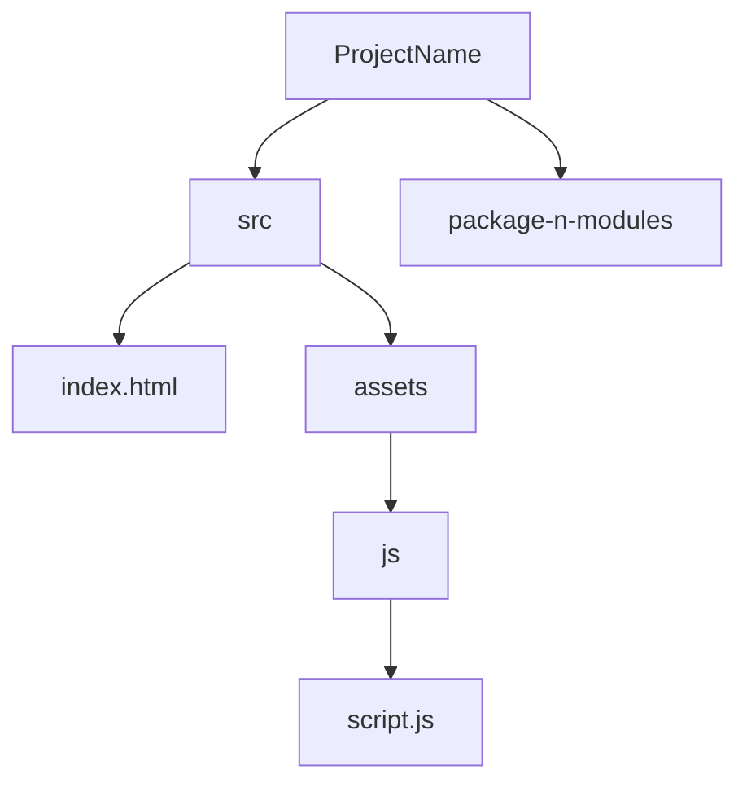

# Algolia
Algolia is a search-as-a-service API that focuses on providing the best experience for the end users. That means being fast and relevant, by returning the best results in a few milliseconds, even with limited input


##  Storing data
1. Create an account on (https://www.algolia.com/)
2. Create an application: get started> top left - create an application
3. rename in bottom left -settings>application>rename
4. go to the application again
5. {To see indexes go to left hand panel and select search option} create index(basically where data is stored )> index name capital( check the naming convention as shown)
6. upload data in the index in the form of JSON either enter manual JSON or you can upload a JSON file  [ you can use (www.mockaroo.com) json generator for product data or anything ]
7. Now your data is uploaded so you can manipulate it to do that 
8. First go to configuration>facets
   


##  CREATING FACETS IN ALGOLIA
- What are facets?
Basically, widgets that we create include lists, menus, refinement lists with checkboxes, range-sliders, menus, etc.
You can check how these facets look like here in [Algolia Showcase](https://www.algolia.com/doc/guides/building-search-ui/widgets/showcase/js/)
This helps us to see data in various formats

1.  Go to configuration tab now that you are inside index of project
2.  Go to facets tab (towards bottom of the list on left side) 
3.  Add attributes( in right hand side) 
- attributes are fields of your json 
4. Set all the attributes to searchable 
5. Customize other settings as required
6. Save changes

## Display Data
1. Go to ui demos tab (besides configuration tab at extreme right)
2. Press Generate new demo
3. Select Instantsearch option
4. Now a page would be created where you can see your data and the facets created
5. You can see this page under a tab inside uidemos tab in form of
6. This tab has three options at right : Delete, edit, view
7. delete: deletes the page , view: you can view the page without manipulating it
8. edit: here yo can add edit facets and get an idea of how it would appear on actual page

## To add facets in page
1. Select add filter
2. Select the type of filter or form you want y our facet to be in 
3. Give title to be displayed
4. add the attribute (that you made during creation of facets)
5. Adjust rest of the parameters as per requirements
6. You can se preview on Right hand side
7. After saving it you can see it on actual page

# Implementing instantSearch.js

## Accessing the Documentaion
1.Go to (https://www.algolia.com/)
2. Select Developers(top bar)> Documentation (dropdown)>new page> Select API references (from top bar)> Select InstantSearch.js under uI libraries
3. You will find documentation of [instantSearch](https://www.algolia.com/doc/api-reference/widgets/js/) but you have to use the same method to see any documentation


## Installing library 
Reference : 
1.  [Install library](https://www.algolia.com/doc/guides/building-search-ui/installation/js/)  : select link of installing libaray on first page of instantSearch.js documentation as already told in Acessing the documentation section
2.  [Dev Parcel](https://parceljs.org/getting-started/webapp/)   parcel >get started> web app

Method :
1. Create folder of project and open vs code in it
2. Inside project create src folder (since we are using parcel we will follow this method of folder structure as parcels package.json has this kind of source)
3. Folder structure of our project :
   
- mermaid feature by markdown is used here to make flowchart which is already supported by github 

# Basic Project hierarchy


4. Write basic html in index.html or use ! and enter to get boilerplate code
5. In same project write terminal commands
(if not in same project do cd projectname path)

```npm init```

   To set up parcel in project
```npm install --save-dev parcel```  

6. Replace 
```
"main": "index.js",
  "scripts": {
    "test": "echo \"Error: no test specified\" && exit 1"
  },
```
  in package.json with 
```
  "source": "src/index.html",
  "scripts": {
    "start": "parcel",
    "build": "parcel build"
  },
```

7. Now everytime you want to run this project use ```npm start```

### installing instant search dependencies

1. Go to  [Install library](https://www.algolia.com/doc/guides/building-search-ui/installation/js/)
2. in terminal ```npm install algoliasearch instantsearch.js```
3. Include
```import instantsearch from 'instantsearch.js';```
in js fie
4. Your js file should look like this, so paste this boilerplate code
```
import algoliasearch from 'algoliasearch/lite';
import instantsearch from 'instantsearch.js';
import { searchBox, hits } from 'instantsearch.js/es/widgets';

searchClient = algoliasearch('YourApplicationID', 'YourSearchOnlyAPIKey');

const search = instantsearch({
  indexName: 'demo_ecommerce',
  searchClient,
});

search.addWidgets([
  searchBox({
    container: "#searchbox"
  }),

  hits({
    container: "#hits"
  })
]);

search.start();
```

5. include this css for having basic css in your html file
```
<script src="https://cdn.jsdelivr.net/npm/algoliasearch@4.24.0/dist/algoliasearch-lite.umd.js" integrity="sha256-b2n6oSgG4C1stMT/yc/ChGszs9EY/Mhs6oltEjQbFCQ=" crossorigin="anonymous"></script>
<script src="https://cdn.jsdelivr.net/npm/instantsearch.js@4.73.4/dist/instantsearch.production.min.js" integrity="sha256-KhJczbX11JwgRQX1pcxQOK+/ymw2x3XxJqz1CUIMHBk=" crossorigin="anonymous"></script>
```
6. replace 'YourApplicationID', 'YourSearchOnlyAPIKey' with respective value


### How to find your aplication ID and your api key
1. Go to dashboard (https://dashboard.algolia.com/apps/S4DA3UQ9TS/dashboard) and login
2. go to settings in bottom left
3. Select "API keys" option under Team and access
4. Now you can copy Application ID and search api key from here
   (https://dashboard.algolia.com/account/api-keys/all?applicationId=S4DA3UQ9TS)

### Reference links
Now that the basic setup is done use these links to read documentations to implement the next things

1. [hits](https://www.algolia.com/doc/api-reference/widgets/hits/js/) Use hits section of the documentation to print hits 
hits: results of the json 

2. [facets](https://www.algolia.com/doc/api-reference/widgets/js/) try different kinds of facets mentioned in side bar menu to implement in the code. Try menu, hits, hierarchicalMenu, rangeSlider, pagination, voiceSearch etc 


3.[multiple index](https://www.algolia.com/doc/api-reference/widgets/index-widget/js/) if you have multiple index use this article. 
-For example in my application called 'e_commerce' there are two index called CLOTH and SHOES which have data of clothes and shoes respectively so to search on the multiple index that is if i type blue on searchbar it should search on data of shoes and clothes as well giving blue shoes and data.


 
To include: how to have multiple index
routing 
autocomplete

8/08/2024
1. configure
2. API parameters
3. sortFacetValuesBy
4. 


   

   

   

